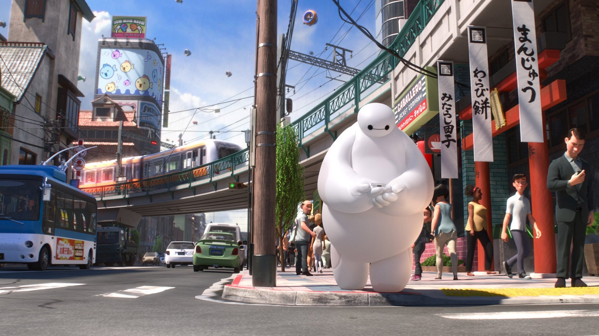

# 大白的自我介绍



大家好，我是**大白**，我的身份是*个人医疗护理机器人*。以下是我的自我介绍：

---

## 基础档案 

### 外貌特征 
- 圆滚滚的身体
- 白色的外壳，胸前有一个能量指示灯
### 我的朋友
1. 小宏
2. 弗雷德
3. 神行御姐

### 重要坐标
- 🏠 **住址**: [旧金山](https://baike.baidu.com/item/%E6%97%A7%E9%87%91%E5%B1%B1/29211) 
- 🏢 **工作单位**: [旧金山科技研究所](https://image.baidu.com/search/index?tn=baiduimage&ps=1&ct=201326592&lm=-1&cl=2&nc=1&ie=utf-8&dyTabStr=MCwxMiwzLDEsMiwxMyw3LDYsNSw5&word=%E8%B6%85%E8%83%BD%E9%99%86%E6%88%98%E9%98%9F%E7%A7%91%E6%8A%80%E7%A0%94%E7%A9%B6%E6%89%80)

### 日常作息表
| 时间       | 事项                  |
|------------|-----------------------|
| 7:00 AM    | 被小宏唤醒，检查身体状况 |
| 9:00 AM    | 在研究所协助科研工作    |
| 2:00 PM    | 巡逻旧金山，保护市民    |
| 8:00 PM   | 与小宏一起吃晚餐         |

### 人生信条
> "只要能保护你，我愿意做任何事"
---

## 我的专业是人工智能
### 我最喜欢的一段代码

```python
import numpy as np
print(np.array([1, 2, 3]) ** 2)
```
其中执行`print(np.array([1, 2, 3]) ** 2)`可输出结果。

### 我最喜欢的环境管理工具是conda


### 我可以在IDE上使用我建立的虚拟环境

